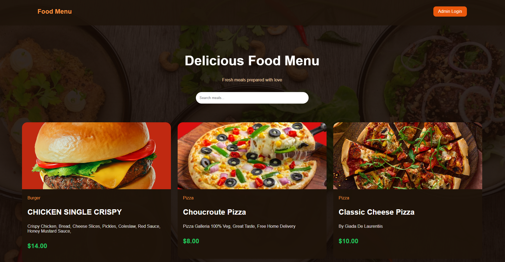
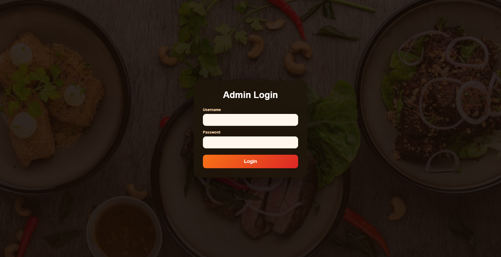
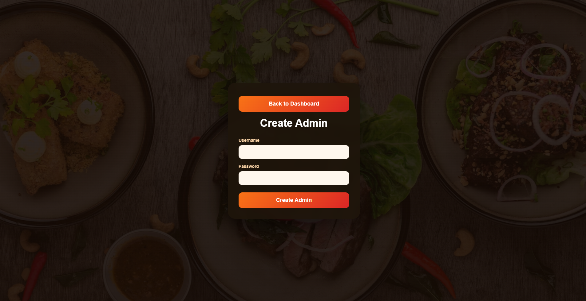
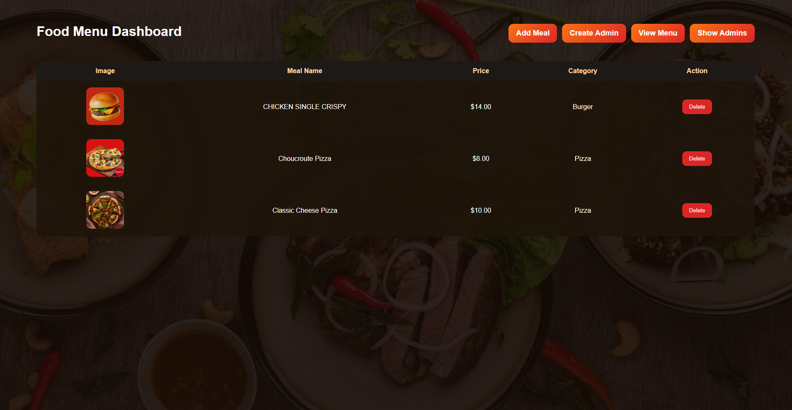
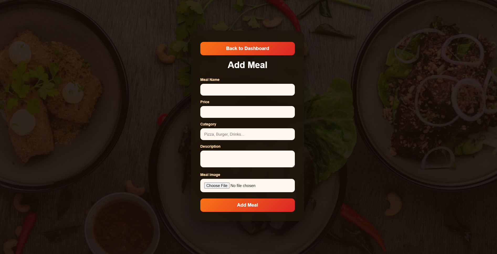
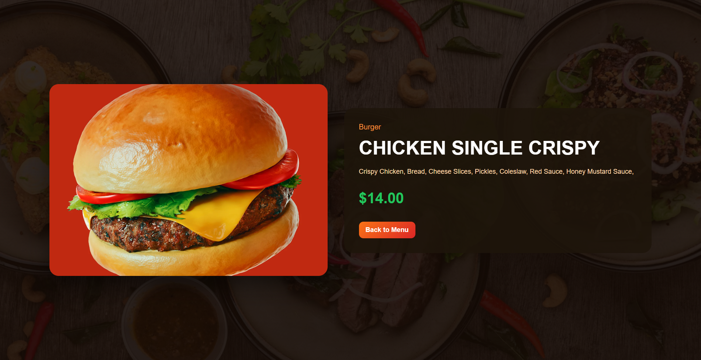
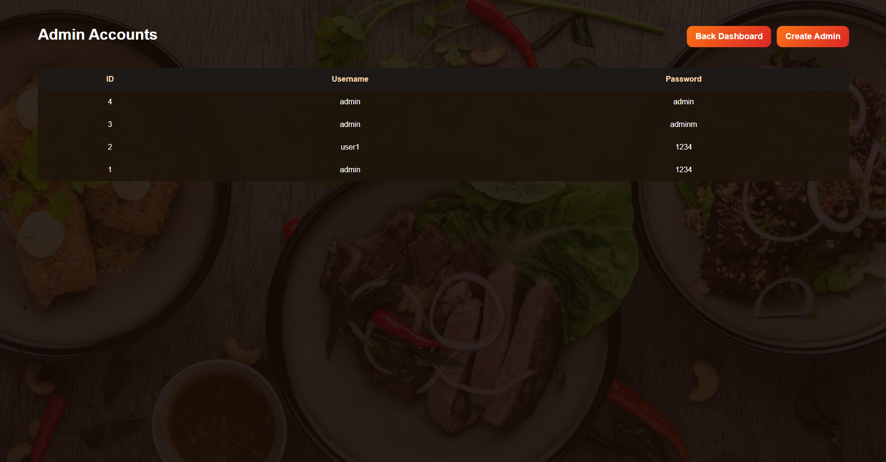

# 🍽️ Food Menu Management System

A web-based Food Menu Management System developed using PHP, MySQL, HTML, CSS, and JavaScript. The system allows administrators to manage meals, menu items, and administrator accounts through an easy-to-use dashboard.

---

## ✨ Features

- 🔐 Admin Authentication
- 👤 Create Admin Accounts
- 🍔 Add Meals
- 🗑 Delete Meals
- 📋 View Food Menu
- 📄 Meal Details
- 👥 Manage Administrators
- 🖼 Upload Meal Images
- 📱 Responsive Design

---

## 🛠 Technologies Used

- PHP
- MySQL
- HTML5
- CSS3
- JavaScript
- SQL

---

# 📸 Screenshots

## 🏠 Home Page



---

## 🔐 Admin Login



---

## 👤 Admin Registration



---

## 📊 Admin Dashboard



---

## ➕ Add Meal



---

## 🍽 Meal Details



---

## 👥 Manage Administrators



---

# 🚀 How to Run

1. Clone or download the repository.
2. Copy the project folder to the **htdocs** directory.
3. Import the **food_menu_db.sql** database into MySQL.
4. Start **Apache** and **MySQL** using XAMPP.
5. Open the project in your web browser.

---

# 📁 Project Structure

```text
Food-Menu-System
│
├── images/
├── screenshots/
├── add_meal.php
├── admin_dashboard.php
├── admin_login.php
├── create_admin.php
├── db.php
├── delete_meal.php
├── food_menu_db.sql
├── meal_details.php
├── menu.php
├── show_admins.php
├── script.js
└── style.css
```

---

# 👨‍💻 Author

**Abdalwahab Al-Qatawneh**

GitHub:
https://github.com/Abedulwahab
